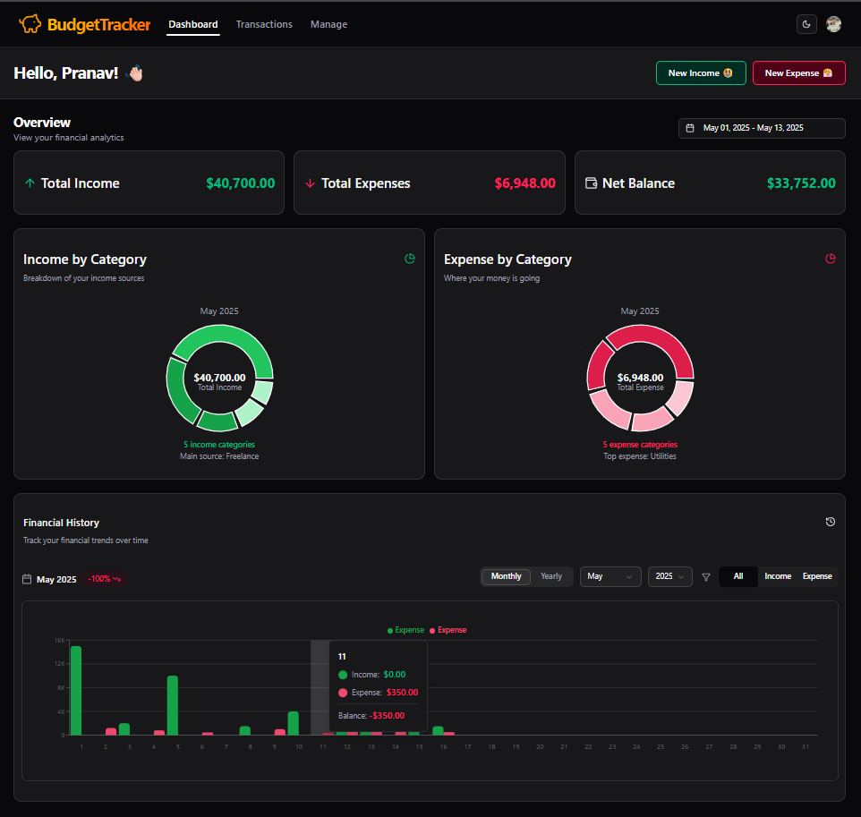
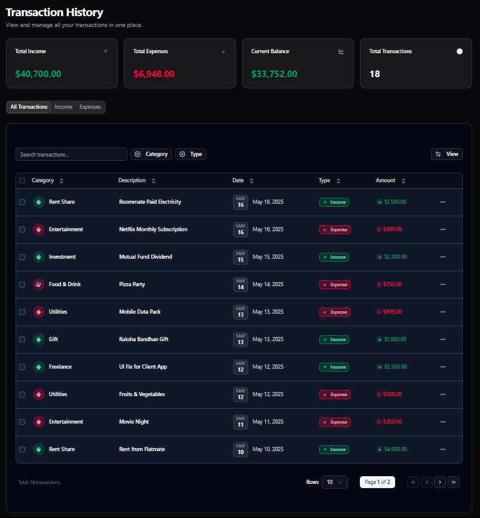
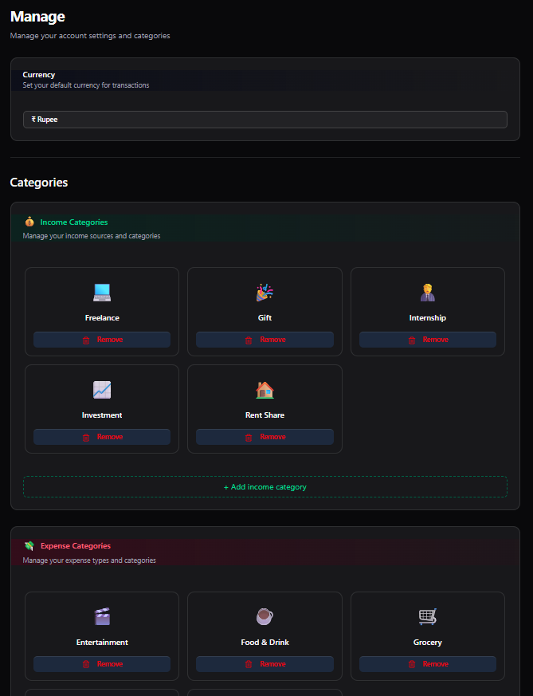

# Budget Tracker App

A modern, responsive personal finance tracking application built with Next.js, React, TypeScript, and Prisma. This full-stack application helps users track their income and expenses, visualize spending patterns, and manage their financial goals with an intuitive dashboard interface.



## Features

- **User Authentication**: Secure user authentication system using Clerk
- **Dashboard Overview**: Visual summary of financial status with key metrics
- **Transaction Management**: Track all income and expenses with detailed categorization
- **Category Management**: Create and manage custom categories for income and expenses
- **Data Visualization**: Interactive charts and graphs showing spending trends and patterns
- **Financial History**: Track financial performance over time with historical data
- **Income/Expense Filtering**: Filter transactions by type, category, date range, and more
- **Dark Mode**: Elegant dark-themed UI for comfortable viewing
- **Responsive Design**: Fully responsive interface that works on desktop, tablet, and mobile
- **Currency Support**: Multiple currency format support

## Tech Stack

- **Frontend**: Next.js 15, React, TypeScript, Tailwind CSS
- **UI Components**: shadcn/ui, Lucide React icons
- **Authentication**: Clerk
- **Database**: SQLite (development), Prisma ORM
- **State Management**: React hooks and context
- **Data Visualization**: Chart.js

## Screenshots

### Transaction History



### Category Management



## Getting Started

### Prerequisites

- Node.js 18.0 or higher
- npm or yarn package manager

### Clone the Repository

```bash
git clone https://github.com/your-username/budget-tracker.git
cd budget-tracker
```

### Install Dependencies

```bash
npm install
# or
yarn install
```

### Set up Environment Variables

Create a `.env.local` file in the root directory with the following variables:

```
# Clerk Auth
NEXT_PUBLIC_CLERK_PUBLISHABLE_KEY=your_clerk_publishable_key
CLERK_SECRET_KEY=your_clerk_secret_key

# NextJS
NEXT_PUBLIC_APP_URL=http://localhost:3000
```

### Set up Database

```bash
npx prisma migrate dev
```

### Run the Development Server

```bash
npm run dev
# or
yarn dev
```

Open [http://localhost:3000](http://localhost:3000) with your browser to see the application.

## Project Structure

- `/app` - Next.js App Router components and pages
  - `/(auth)` - Authentication pages
  - `/(dashboard)` - Dashboard pages and components
  - `/api` - API routes
  - `/wizard` - Onboarding wizard
- `/components` - Reusable UI components
  - `/ui` - shadcn/ui components
- `/lib` - Utility functions and shared code
- `/prisma` - Prisma schema and migrations
- `/public` - Static files

## Usage

1. Register for a new account
2. Complete the onboarding wizard to set up your preferences
3. Add your income and expense transactions
4. View your financial summary and reports on the dashboard
5. Manage categories and track your spending over time
